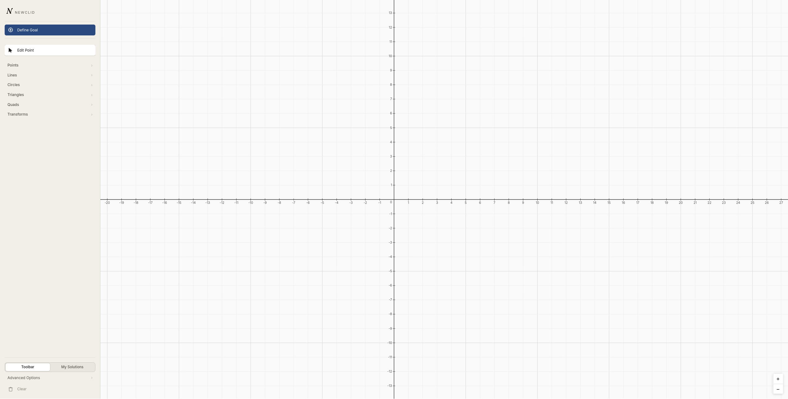
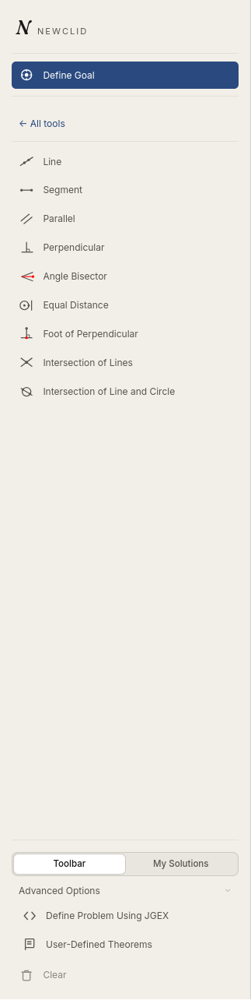
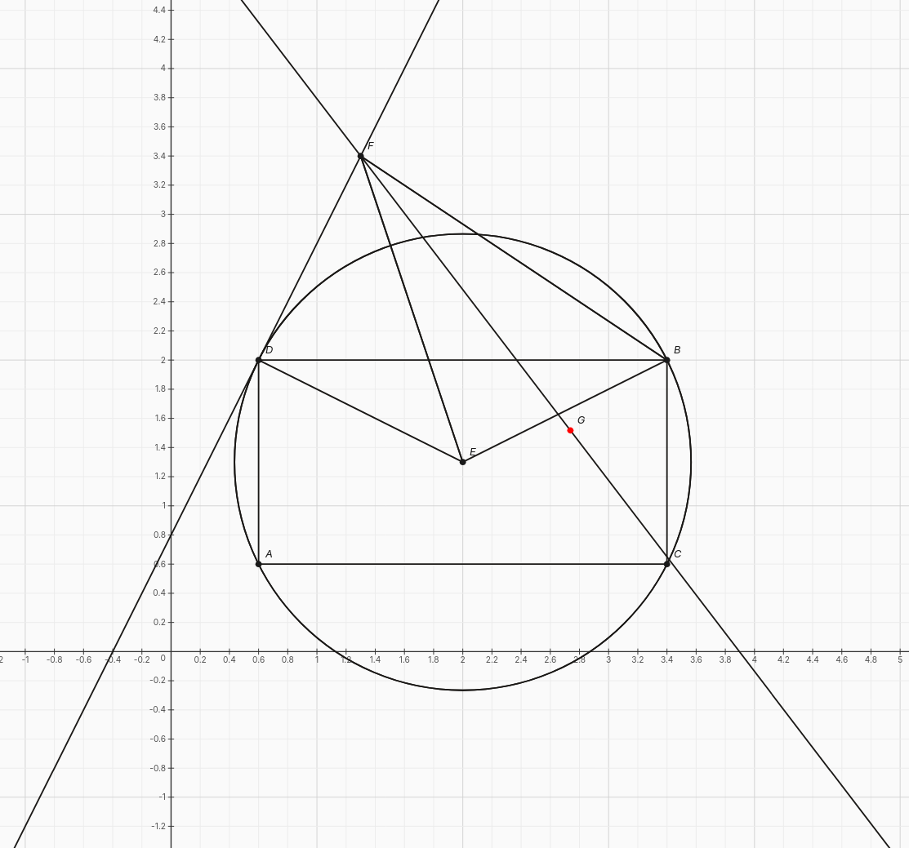
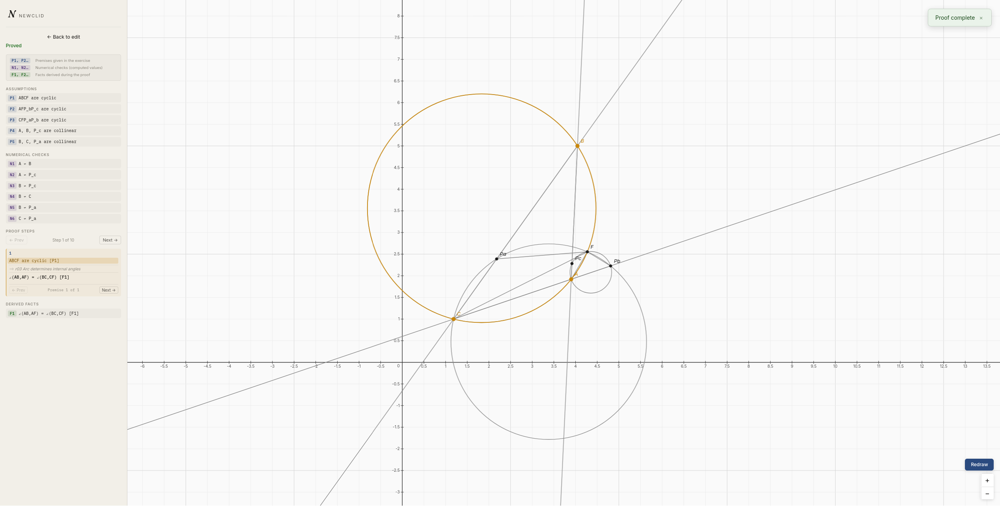
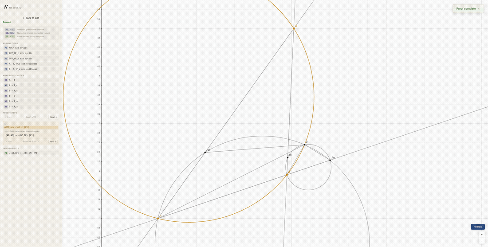

# Viewclid

**A web application for [Newclid](https://github.com/Newclid/Newclid): construct plane geometry problems visually, solve them with the Newclid/Yuclid engine, and step through the generated proof.**


---

## Overview

[Newclid](https://github.com/Newclid/Newclid) is a fast, open-source solver for plane geometry problems, but using it means writing JGEX by hand and running a CLI or Python script. **Viewclid** removes that barrier: it's a self-hostable web application that lets anyone construct a geometry problem visually, define a goal, optionally add custom theorems, and watch the solver produce a step-by-step, highlighted proof, right in the browser.

Viewclid is made of two independently deployable pieces that ship together in this repository:

| Component | What it does |
|---|---|
| **[`frontend/`](frontend/)** | A framework-light TypeScript/Vite single-page app: an interactive SVG canvas for constructing problems, a toolbar of geometry tools, goal and custom-theorem editors, and a proof viewer with canvas-based step highlighting. |
| **[`backend/`](backend/)** | A FastAPI service that turns problem submissions into asynchronous solver jobs, runs them against the real Newclid/Yuclid engine via a Redis/RQ worker, and returns normalized proof results. |

## Features

- Visual construction workspace: points, lines, circles, triangles, angle bisectors, intersections, and more, with pan/zoom and snapping.
- Goal definition and custom theorem authoring, without writing JGEX by hand (direct JGEX input is also supported for advanced users).
- Asynchronous solving: problem submission returns immediately, and the browser polls job status while the real engine runs in a background worker.
- Step-by-step proof playback with synchronized highlighting on the construction canvas.
- Self-hostable end to end via Docker Compose: frontend, API, worker, and Redis all run as containers behind a single nginx entry point.

## Tech stack

| Layer | Technology |
|---|---|
| Geometry engine | [Newclid](https://github.com/Newclid/Newclid) (Python) + Yuclid (C++/pybind11 generic rule matcher) |
| Backend | Python 3.11+, FastAPI, Redis, RQ, Uvicorn, [uv](https://docs.astral.sh/uv/) |
| Frontend | TypeScript, Vite, vanilla DOM/SVG/Canvas (no UI framework), Vitest, Playwright |
| Infrastructure | Docker, Docker Compose, nginx |

## Architecture

```text
 Browser
    │  draw problem · define goal · add theorems
    ▼
 frontend (nginx)  ── proxies /api/ ──▶  backend API (FastAPI)
                                              │  enqueues job
                                              ▼
                                        Redis / RQ queue
                                              │  picked up by
                                              ▼
                                          RQ worker
                                              │  runs
                                              ▼
                                     Newclid + Yuclid engine
                                              │  proof result
                                              ▼
                                   stored in Redis, polled by
                                     frontend, rendered as
                                    step-by-step highlighted
                                             proof
```

The backend never runs the solver inside an HTTP request. Solving happens in a separate worker process, so the API stays responsive regardless of how long a proof search takes. See [`docs/manual/development/`](docs/manual/development/) for the full architecture writeups and the frontend↔backend↔engine contracts.

## Screenshots

<p align="center">
  
  <br>
  <em>Home page: start a new problem from a blank workspace.</em>
</p>

<table>
  <tr>
    <td width="22%" valign="top">
      
      <br>
      <em>Construction toolbar</em>
      <br>
      <sub>This view shows only a subset of the available tools.</sub>
    </td>
    <td width="78%" valign="top">
      
      <br>
      <em>Drawing workspace: a problem under construction on the interactive canvas.</em>
    </td>
  </tr>
</table>

<p align="center">
  
  <br>
  <em>Solution page: the completed proof, with the full step-by-step breakdown and canvas highlighting.</em>
</p>

<p align="center">
  
  <br>
  <em>Solving a problem: the solver runs and the proof is revealed step by step on the canvas.</em>
</p>

## Getting started

The fastest way to run the full stack (frontend + backend + worker + Redis) is Docker Compose.

**Requirements:** Docker and Docker Compose.

```bash
git clone https://github.com/Newclid/Viewclid.git
cd Viewclid

docker compose \
  -f docker-compose.yml \
  -f docker-compose.dev.yml \
  up --build
```

Then open:

```text
http://localhost:8080
```

The frontend container proxies `/api/` to the backend, so no extra configuration is needed. Check the backend health endpoint directly with:

```bash
curl http://localhost:8080/api/health
```

To run only part of the stack (e.g. backend services during frontend-only work, or vice versa), pass service names:

```bash
docker compose -f docker-compose.yml -f docker-compose.dev.yml up --build api worker redis
docker compose -f docker-compose.yml -f docker-compose.dev.yml up --build web
```

## Backend

The backend is a FastAPI service that accepts solver jobs, queues them in Redis via RQ, executes them against Newclid/Yuclid in a worker process, and exposes endpoints for job status and results (`POST /api/jobs`, `GET /api/jobs/{id}`, `GET /api/jobs/{id}/result`).

Quick local run, without Docker:

```bash
cd backend
uv sync
uv run uvicorn newclid_backend.main:app --reload   # in one terminal
uv run rq worker newclid                            # in another terminal
```

Requires a running Redis-compatible server (`docker run --rm -p 6379:6379 redis:7`).

**See [`backend/README.md`](backend/README.md)** for full setup, configuration reference, API details, and the backend test suite.

## Frontend

The frontend is a vanilla TypeScript/Vite single-page app, with no UI framework. Geometry rendering is split between SVG (interactive construction) and Canvas (proof step highlighting), organized into clearly separated layers (geometry, scene, input, render, UI, API client).

Quick local run:

```bash
cd frontend
npm ci
npm run dev
```

Runs at `http://localhost:5173` and expects a backend reachable at `/api` (run the backend separately, or use Docker Compose for the full stack).

**See [`frontend/README.md`](frontend/README.md)** for the full project layout, testing (Vitest + Playwright), and Docker build details.

## Project structure

```text
Viewclid/
├── backend/                     FastAPI + Redis/RQ asynchronous solver service
├── frontend/                    TypeScript/Vite web client
├── docs/manual/development/     Architecture guides and frontend/backend/engine contracts
├── docker-compose.yml           Full-stack service definitions
├── docker-compose.dev.yml       Local development overrides
└── docker-compose.deploy.yml    Production/TLS overrides
```

## Documentation

In-depth architecture notes, guides, and the frontend↔backend↔engine data contracts live under [`docs/manual/development/`](docs/manual/development/):

- [`backend/`](docs/manual/development/backend/): backend architecture, API reference, setup, and testing.
- [`frontend/`](docs/manual/development/frontend/): frontend architecture, setup, and testing.
- [`contracts/`](docs/manual/development/contracts/): the JGEX problem input, custom theorem, solver job lifecycle, and proof result contracts shared between frontend and backend.

## Testing

Each component owns its own test suite. See [`backend/README.md`](backend/README.md#testing) and [`frontend/README.md`](frontend/README.md#testing) for full commands.

## License

License terms for this repository are being finalized. See the component-level `NOTICE.md` files ([`backend/NOTICE.md`](backend/NOTICE.md), [`frontend/NOTICE.md`](frontend/NOTICE.md)) for authorship and third-party attributions in the meantime.

## Authors

- [Simeon Vutov](https://github.com/SimeonVutov)
- [Petar Iliev](https://github.com/PSpinosaurus)
- [Georgi Georgiev](https://github.com/Shureto)
- [Hristo Bozhkov](https://github.com/hristobo)
- [Sayf Persevi](https://github.com/SayfPersevi)
