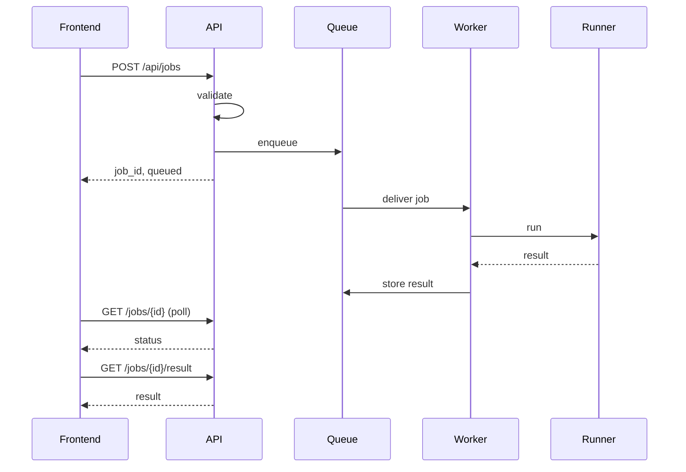

# Backend architecture

The backend is an asynchronous job service around Newclid. Its job is to
accept solver requests quickly, move expensive solver work out of the HTTP
request path, and return normalized proof results the frontend can render.

## Request flow

Roles above map to files as in the [layers table](#layers) below: API =
`routers/jobs.py`, Queue = `queue.py`, Worker = `tasks.py`, Runner =
`newclid_runner.py`.

## Layers

| Layer | Main files | Responsibility |
|---|---|---|
| HTTP | `main.py`, `routers/jobs.py`, `schemas.py` | FastAPI app, request validation, public responses, status mapping. |
| Queue | `queue.py`, `tasks.py` | Redis/RQ connection, enqueue options, worker task adapter. |
| Runner | `newclid_runner.py`, `runner_helpers.py`, `runner_models.py` | Build a Newclid problem, run the solver, convert proof data, return a stable result model. |
| Configuration | `settings.py` | Environment variables for Redis, queue names, timeouts, TTLs, output limits. |

See the [module pages](modules/index.md) for a page per layer.

## Status model

The backend has two status vocabularies:

- **RQ status** — the internal queue status: `queued`, `started`,
  `finished`, `failed`, …
- **Public job status** — the frontend-facing status documented in the
  [solver job lifecycle contract](../contracts/solver-job-lifecycle.md).

The mapping between the two lives in `routers/jobs.py`, because it's part of
the HTTP contract, not the runner.

## Result path

The worker returns a plain dictionary to RQ — `NewclidRunResult.model_dump()`.
The API exposes it inside the `result` field of the job result response. That
means the result model crosses two boundaries:

1. **Runner boundary** — internal Python objects become Pydantic models.
2. **HTTP boundary** — FastAPI serializes those models as JSON.

## Design decisions

| Rule | Reason |
|---|---|
| Never run Newclid inside a request handler. | Solver runs can be slow; HTTP requests must stay responsive. |
| Keep the queue adapter small. | RQ should call one simple task function; solver logic should stay testable without RQ. |
| Validate public input with Pydantic. | Invalid requests should fail before they create queued work. |
| Normalize solver output once. | The frontend gets stable fields even if Newclid internals change. |
| Keep shared contracts out of area docs. | Frontend and backend pages should link to the same [contract pages](../contracts/index.md) instead of duplicating them. |

## Where to go next

- Changing something? Start with the [guides](guides/index.md).
- Adding or removing an HTTP-visible field? Update the relevant
  [contract](../contracts/index.md) too.
