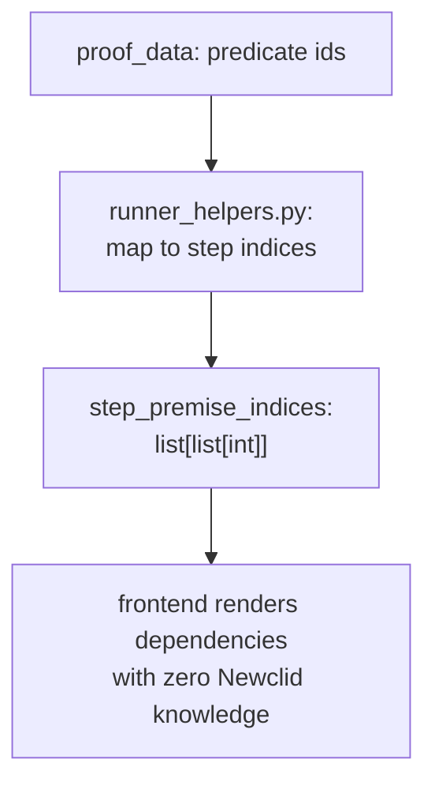

# Exposing new proof data

Use this guide when Newclid produces useful data — a statistic, a new kind
of proof step, a piece of the solved geometry — that the frontend needs to
render, inspect, or debug. The result of a solve is a `NewclidRunResult`
(see the [proof result model contract](../../contracts/proof-result-model.md)
for its full shape); this guide is about adding a field to it.

## Where this code actually runs

`newclid_runner.run_newclid_from_jgex` — the function that builds
`NewclidRunResult` — is only ever called from `tasks.run_newclid_job`, which
RQ executes inside the **worker** process, not the API process (see the
[backend architecture](../architecture.md)). Concretely, that means any
conversion code you write here has no access to the original HTTP request —
only to `solver` and `proof_data`, the objects Newclid itself produced.

## The pipeline, and its working template

`step_premise_indices` is already in `NewclidProofSections` and is the
reference example to copy — it turns internal predicate ids into indices the
frontend can use with zero knowledge of Newclid's own data structures:

```python
# runner_helpers.py
def _build_step_premise_indices(proof_data: Any) -> list[list[int]]:
    id_to_step_idx = {
        step.proven_predicate.id: i for i, step in enumerate(proof_data.proof_steps)
    }
    return [
        sorted(
            {
                id_to_step_idx[pid]
                for pid in step.applied_on_predicates
                if pid in id_to_step_idx
            }
        )
        for step in proof_data.proof_steps
    ]
```



This is called from `newclid_runner._build_proof_sections`, right after
`write_proof_sections` builds the rest of `NewclidProofSections` — that's
the pattern for any field derived from `proof_data` rather than copied
as-is.

## Steps

1. **Identify the source of the data** — `solver.run_infos` (stats),
   `proof_data` (points, steps, predicates), or an exception (`stderr`).
2. **Add the field to `NewclidRunResult` or `NewclidProofSections`** in
   `runner_models.py`. Prefer structured data (lists, small dicts) over
   pre-formatted strings if the frontend will inspect it programmatically —
   `step_premise_indices` exists specifically because raw predicate ids
   weren't usable by the frontend on their own.
3. **Populate it in `newclid_runner.py`**, near `_build_proof_data` /
   `_build_proof_sections` / `_build_sketch_points`. Move the conversion into
   `runner_helpers.py` if it's reusable or non-trivial, following
   `_build_step_premise_indices`.
4. **Handle the failure path.** `proof_sections` (and `proof_text`,
   `sketch_points`) are only populated when `status == "succeeded"` — on
   `"failed"` they're `None`/`[]`. If your new field lives on
   `NewclidProofSections`, the frontend must not assume it's present outside
   a successful run.
5. **Update the contract** — the
   [proof result model contract](../../contracts/proof-result-model.md) is
   what frontend and backend docs both point to, so update it in the same
   change.
6. **Update the frontend proof UI docs** — whoever owns
   [proof UI](../../frontend/modules/proof-ui.md) should document how the
   new field gets displayed.
7. **Add tests** — a runner-helper test for the conversion function in
   isolation, and an end-to-end test asserting the field survives
   `NewclidRunResult.model_dump()` and the HTTP response.

## Design rule

Expose stable concepts, not raw Newclid internals — `step_premise_indices`
over forcing the frontend to inspect predicate ids itself.

!!! warning "`stdout` exists on `NewclidRunResult` but is never populated"
    `NewclidRunResult.stdout` defaults to `""` and nothing in
    `newclid_runner.py` ever sets it — only `stderr` is populated, and only
    on an exception. Don't assume `stdout` already carries solver console
    output if you're building something that needs it; that field is
    currently a no-op.
