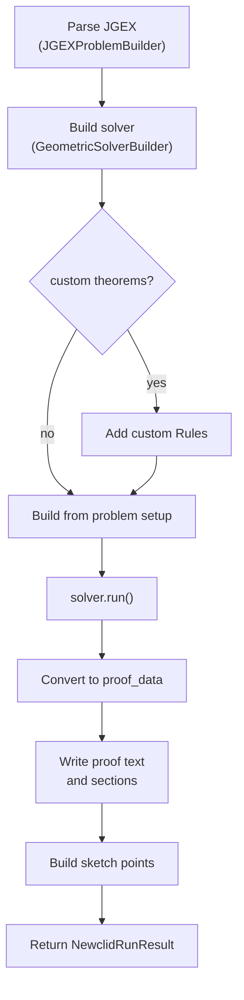

# Runner

The runner is the only backend layer that calls Newclid directly.

Source: `newclid_runner.py`, `runner_helpers.py`, `runner_models.py`

## Entry point

```python
run_newclid_from_jgex(jgex_problem, custom_theorems=None)
```

This returns a `NewclidRunResult` model, not a FastAPI response — which makes
the runner directly testable, without HTTP, Redis, or RQ.

## Execution steps



## JGEX parsing boundary

The API route does **not** parse JGEX — parsing happens inside the runner via
`JGEXProblemBuilder`. This matters for error handling: malformed JGEX is
reported as a **failed solver job**, not a synchronous API validation error.

## Proof conversion

On success, the runner builds proof data from the solver state, then produces
two frontend-facing forms:

- `proof_text` — full human-readable proof text, from `write_proof`.
- `proof_sections` — structured sections, from `write_proof_sections`.

It also builds `sketch_points` from the proof data so the frontend can draw
the final solved sketch. All three are defined in the
[proof result model contract](../../contracts/proof-result-model.md).

## Failure behavior

The runner catches exceptions and converts them into a `NewclidRunResult`
with `status="failed"` — the exception message goes into `message`, the
truncated traceback into `stderr`.

!!! note "Two ways to fail, one public outcome"
    If the solver runs without raising but doesn't prove all goals, the
    runner *also* returns `status="failed"`, with the message:

    ```text
    Newclid finished, but did not prove all goals.
    ```

    The distinction is useful for debugging (see
    [debugging job failures](../guides/debug-job-failures.md)), but both
    cases are equally "failed" from the API's point of view.

## Output truncation

Long output is truncated by keeping the **last** `MAX_OUTPUT_CHARS`
characters (see [configuration](configuration.md)) — for proof text and
exception tracebacks alike, so Redis never stores unbounded output. The end
of a traceback is kept because it usually holds the most useful error
message.
