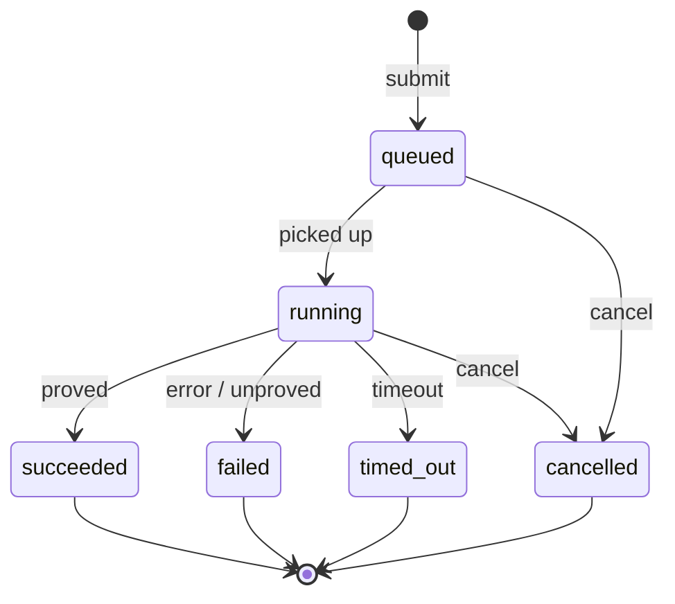

# Solver job lifecycle

This is the canonical definition of a solver job's public status model and
the three endpoints that create, poll, and resolve a job. Both the
[backend API layer](../backend/modules/api.md) and the
[frontend backend-integration layer](../frontend/modules/backend-integration.md)
implement this contract — if you change one side, update this page and the
other side together.

## Status state machine



| Status | Meaning |
|---|---|
| `queued` | Job created, not yet picked up by a worker. |
| `running` | A worker is actively executing the job. |
| `succeeded` | Newclid proved all goals. |
| `failed` | Newclid finished without proving all goals, or the runner raised an exception. |
| `timed_out` | Reserved for a runner-level timeout. Not currently reachable — see the callout below. |
| `cancelled` | The job was interrupted by queue control, not by the solver itself. |

!!! warning "`timed_out` is not currently reachable"
    The status type and the RQ→public mapping both support `timed_out`, but
    nothing currently produces it. When RQ itself kills a job for exceeding
    `timeout_seconds`, the job's RQ status becomes `failed` — which the
    backend maps straight to public `failed` before ever inspecting a result
    payload for `status: "timed_out"`. A slow job that hits its timeout is
    indistinguishable from any other failure today: same status, a generic
    `"Newclid failed."` message, no traceback. See
    [debugging job failures](../backend/guides/debug-job-failures.md) for how
    to recognize this case anyway (job duration close to `timeout_seconds`).

!!! info "This is the RQ-derived status, not RQ's own status"
    Internally, RQ has its own status vocabulary (`queued`, `started`,
    `finished`, `deferred`, …). The backend translates that into the public
    status above — see the mapping table on the
    [backend API page](../backend/modules/api.md#status-mapping). Frontend
    code should only ever depend on the public status in this table.

## Endpoints

Every response on every endpoint below includes `job_id`, echoing the id
from the path or the newly created job.

### Create a job

```http
POST /api/jobs
```

```json title="Request"
{
  "input_type": "jgex",
  "problem_input": "a b c = triangle a b c ? cong a b a b",
  "custom_theorems": [],
  "timeout_seconds": 120
}
```

| Field | Required | Meaning |
|---|---|---|
| `input_type` | No, defaults to `"jgex"` | Currently the only supported format — see the [JGEX problem input contract](jgex-problem-input.md). |
| `problem_input` | Yes | The full problem string, construction + goal clauses. |
| `custom_theorems` | No, defaults to `[]` | See the [custom theorem contract](custom-theorem-contract.md). |
| `timeout_seconds` | No, defaults to `120` | A plain default on this field, independent of the backend's `DEFAULT_JOB_TIMEOUT_SECONDS` setting — see the note on [backend configuration](../backend/modules/configuration.md#timeout-configuration). |

```json title="Response — 200"
{
  "job_id": "3f9c1a2e-...",
  "status": "queued"
}
```

### Poll status

```http
GET /api/jobs/{job_id}
```

```json title="Response"
{
  "job_id": "3f9c1a2e-...",
  "status": "running",
  "message": "Job is running."
}
```

`message` is always present today — every public status maps to a
human-readable string (see [status messages](../backend/modules/api.md#status-mapping)).

Returns `404` for an unknown `job_id`.

### Fetch the result

```http
GET /api/jobs/{job_id}/result
```

| Status when called | Response |
|---|---|
| `queued` / `running` | `{"job_id": ..., "status": ..., "result": null, "error": null}` |
| `cancelled` | `{"job_id": ..., "status": "cancelled", "result": null, "error": "Job was cancelled."}` |
| `succeeded` | `{"job_id": ..., "status": "succeeded", "result": <ProofResultModel>, "error": null}` |
| `failed` / `timed_out` | `{"job_id": ..., "status": ..., "result": <ProofResultModel>, "error": "<same text as result.message>"}` |
| Worker crashed before returning a result at all | `{"job_id": ..., "status": "failed", "result": null, "error": "Newclid job failed for unknown reason"}` |

`error` is only ever `null` for a `succeeded` job — for `failed`/`timed_out`
it duplicates `result.message`, so treat it as a summary you can show without
reaching into `result`, not as evidence something *else* went wrong. See the
[proof result model contract](proof-result-model.md) for the shape of
`result`.

## Polling contract

The frontend's `JobPoller` polls `GET /api/jobs/{job_id}` **every 2 seconds**
until it observes a terminal status (`succeeded`, `failed`, `timed_out`,
`cancelled`), then fetches the result exactly once. A `4xx` response from any
polling request stops the poller permanently — it does not retry on client
errors, only on transient network failures.

!!! tip "Debugging a stuck job"
    If a job never leaves `queued`, the most common cause is that no RQ
    worker is running, or it's listening to the wrong queue/Redis URL. See
    [Debugging job failures](../backend/guides/debug-job-failures.md).
