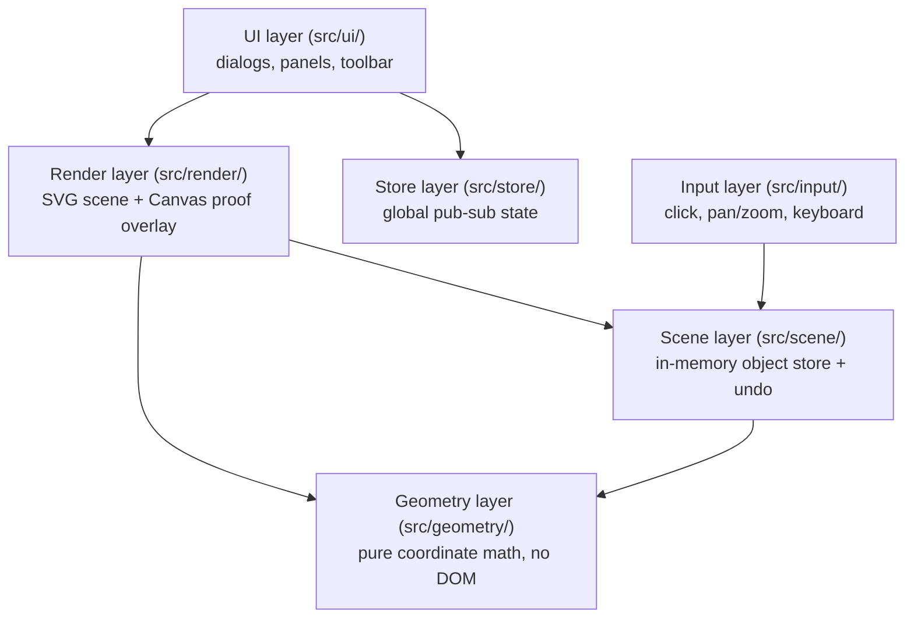

# Frontend architecture

The frontend is written in vanilla TypeScript with no UI framework. Vite
handles bundling and the dev server. The code is organized into discrete
layers, each with a single responsibility, that communicate through
well-defined interfaces rather than shared globals.

## Layers

| Layer | Responsibility |
|---|---|
| **Geometry** | Pure functions for coordinate transforms, distance, hit-testing, viewport math. No side effects, no DOM — testable in isolation. |
| **Scene** | Single source of truth for what's on the canvas. Listener pattern for mutations; undo stack capped at 100 snapshots. |
| **Input** | Translates raw DOM events (clicks, wheel, keyboard) into intent — routes clicks to the active tool, updates the viewport on pan/zoom, switches tools or triggers undo on keyboard shortcuts. |
| **Render** | Reads the scene and viewport to produce a visual. SVG for static geometry (grid, axes, objects), Canvas 2D for the proof-step overlay. |
| **Store** | State that doesn't belong to the canvas: the current JGEX problem string, job history, proof mode flag, custom theorems. Same listener pattern as the scene. |
| **UI** | Builds and updates DOM panels (toolbar, proof panel, theorem manager). Reads from stores and the scene; never writes to them directly. |

See the [module pages](modules/index.md) for one page per layer. One area
doesn't map to a single box above: [custom theorems](modules/custom-theorems.md)
cut across three of them — persisted in the Store layer (`TheoremStore`),
edited in the UI layer (the theorem manager), and serialized in the same
pass as [JGEX emission](modules/jgex-emission.md).

## Entry point

`src/main.ts` is the wiring file — it creates the scene, viewport, renderer,
stores, and UI components, then attaches event listeners. It also owns the
job lifecycle: calling the [backend client](modules/backend-integration.md),
starting the poller, and entering proof mode when results arrive.

## Tool framework

Every construction (point, line, triangle, …) implements the `Tool`
interface (`src/tools/tool.ts`). `getTool()` in `src/tools/registry.ts`
returns the right instance for a given tool id. `ConstructionTool`
(`src/tools/construction-tool.ts`) is the base class every construction uses
— it manages slot filling, snapping, preview rendering, and undo capture. See
[Constructions](modules/constructions.md) and
[Adding a construction](guides/add-a-construction.md).

## Coordinate safety

The codebase uses branded types to keep world and screen coordinates from
being mixed up at compile time — see
[Scene and geometry: coordinate types](modules/scene-and-geometry.md#coordinate-types)
for the types and a compile-error example.

## Data flow

A typical user interaction follows this path:

1. User clicks the canvas.
2. `toolDispatcher` converts the screen pixel to a `WorldPoint`, snaps to
   grid, and calls the active tool — see [Tools and input](modules/tools-and-input.md).
3. The tool mutates the scene, adding or modifying `GeoObject`s — see
   [Scene and geometry](modules/scene-and-geometry.md).
4. The scene notifies listeners; the renderer redraws.
5. On submit, `main.ts` serializes the scene to JGEX and calls
   `BackendClient.submitJob()` — see [JGEX emission](modules/jgex-emission.md)
   and the [JGEX problem input contract](../contracts/jgex-problem-input.md).
6. `JobPoller` polls the backend every 2 seconds and updates `AppStore` with
   status and results — see [Backend integration](modules/backend-integration.md)
   and the [solver job lifecycle contract](../contracts/solver-job-lifecycle.md).
7. `AppStore` notifies listeners; the proof panel and renderer update to show
   the proof — see [State stores](modules/state-stores.md) and
   [Proof UI](modules/proof-ui.md).
