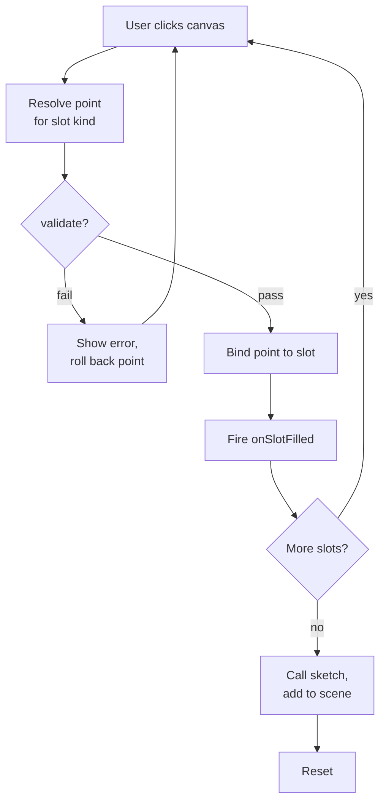

# Constructions

A construction is any multi-step drawing tool the user invokes from the
toolbar — a point, a line, a triangle, a perpendicular, and so on. This
module defines the catalogue of built-in constructions, the slot-filling
framework driving their click-by-click interaction, and the base class every
construction inherits.

Source: `src/construction/catalog.ts`, `src/construction/catalog-types.ts`,
`src/tools/construction-tool.ts`, `src/construction/entries/`

## `CatalogEntry`

Each construction is described by a `CatalogEntry`
(`src/construction/catalog-types.ts`):

| Field | Purpose |
|---|---|
| `name`, `label`, `shortcut`, `icon` | Identity and toolbar display. `icon` is a factory function returning a fresh `<svg>`, not a string. |
| `slots` | Ordered `SlotSpec[]` — one entry per click the user must make. |
| `edges` / `circles` | Required (empty arrays if unused). Slot-**name** pairs used to draw intermediate geometry while slots are still being filled. |
| `sketch(bindings, scene)` | Called once all slots are filled; returns the final object to emit, or `null`. |
| `jgex` | Optional, but present on every real entry — maps the construction to a JGEX clause. See [Adding a construction](../guides/add-a-construction.md#6-add-jgex-without-this-the-construction-never-reaches-the-solver) for why skipping it is a silent trap. |
| `validate(bindings, scene)` | Optional guard that can block completion (e.g. degenerate cases). |
| `preview(bindings, scene, cursor)`, `onSlotFilled(slotName, bindings, scene)` | Hooks for live rubber-band feedback and intermediate snapping. |

Every hook is keyed by **slot name** through a `Bindings` object
(`Record<string, ObjectId | number>`), never by array index.

### `SlotSpec` kinds

| Kind | Behavior |
|---|---|
| `'pick'` | Snaps to an existing point, or creates a new one — whichever the cursor is nearer to. |
| `'pick-existing'` | Only accepts a click on an existing point; rejects empty space. |
| `'place-free'` | Always drops a brand-new point at the cursor (grid-snapped). |
| `'derive'` | The point's position is computed via `project()`, not clicked freely — but a click is still required to advance the construction. Also needs a `preview()` to draw the locus it's constrained to. |
| `'scalar'` | A numeric input (e.g. a length), not a canvas click. |

## `ConstructionTool`

`src/tools/construction-tool.ts` implements the `Tool` interface for every
catalogue entry. Filling a construction's slots is a loop, one iteration per
click, until the last slot triggers `sketch()`:

Before each click, the tool captures a scene snapshot so undo rewinds
exactly one slot. Duplicate detection prevents the same circle or
construction from being added twice.

## Built-in constructions

26 constructions are registered in `src/construction/catalog.ts`, each in
its own file under `src/construction/entries/`:

| Group | Constructions |
|---|---|
| Basic | `select`, `point`, `line`, `segment`, `circle` |
| Polygons | `triangle`, `rectangle`, `parallelogram`, `equilateral_triangle`, `isosceles_triangle` |
| Derived points/lines | `midpoint`, `angle_bisector`, `circumcircle`, `perpendicular`, `parallel`, `foot`, `mirror`, `angle_mirror`, `eqdistance`, `tangent_line`, `on_aline`, `on_circle`, `on_line` |
| Intersections | `intersection_ll` (line–line), `intersection_cc` (circle–circle), `intersection_lc` (line–circle) |

To add a new one, see [Adding a construction](../guides/add-a-construction.md).
