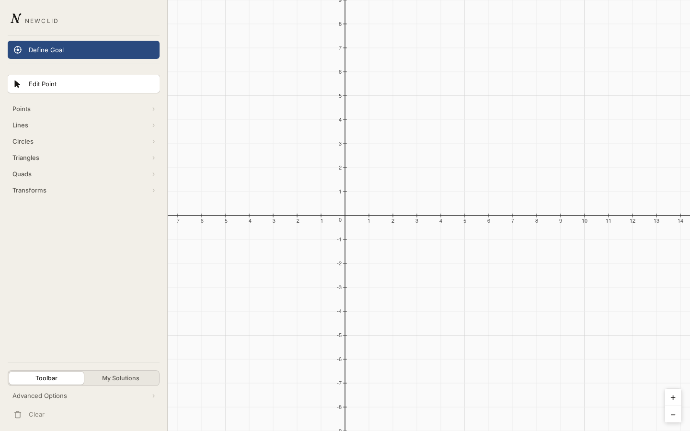
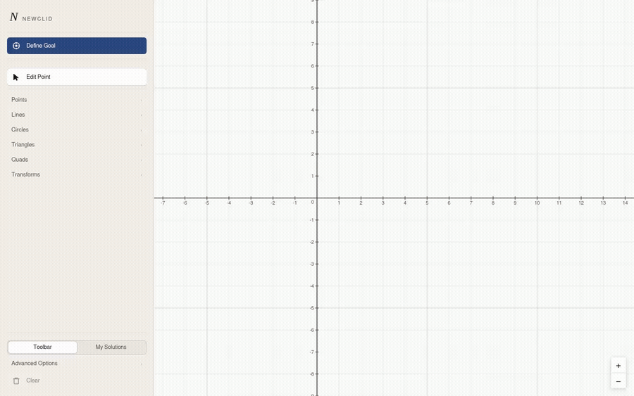
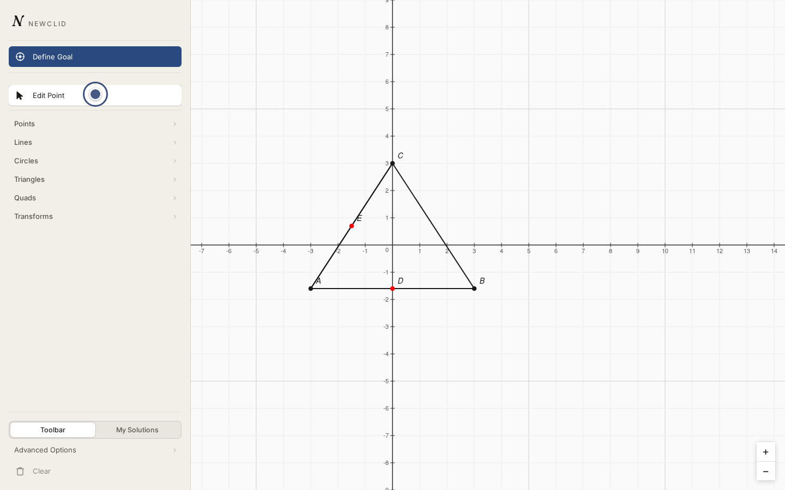

# Constructing a problem

The canvas is where you build the geometry your problem is about — points,
lines, circles, and named shapes like triangles or parallelograms. We'll
build the setup for the midsegment theorem: a triangle `ABC`, and points `D`
and `E` marking the midpoints of two of its sides.



Everything you need for this page lives in the construction tool groups
below **Define Goal** in the toolbar — that button is for the next page.

## The toolbar

The toolbar groups construction tools by category:

| Group | Tools |
|---|---|
| Points | Point, Midpoint, Foot of Perpendicular, Point on Circle, Point on Line |
| Lines | Line, Segment, Parallel, Perpendicular, Angle Bisector, Equal Distance, Foot of Perpendicular, Intersection of Lines, Intersection of Line and Circle |
| Circles | Circle, Circle (3 points), Tangent to Circle, Intersection of Circles, Intersection of Line and Circle |
| Triangles | Triangle, Equilateral Triangle, Isosceles Triangle |
| Quads | Parallelogram, Rectangle |
| Transforms | Mirror Point, Angle Mirror, Angle Transfer (line) |

Click a group to reveal its tools, then click a tool to select it — its
tooltip shows its name and keyboard shortcut. **← All tools** returns to the
group list.


## Drawing the triangle and its midpoints

Every tool works the same way: click the canvas once per step it needs.
Here's the whole construction, start to finish:



1. Open the **Triangles** group and select **Triangle**. Click three times
   on the canvas — those clicks become `A`, `B`, and `C`.
2. Click **← All tools**, open **Points**, and select **Midpoint**.
3. Click `A` then `B` — this creates `D`, the midpoint of `AB`.
4. Select **Midpoint** again, then click `A` then `C` — this creates `E`,
   the midpoint of `AC`.

Clicking near an existing point reuses it instead of creating a duplicate —
that's how `D` and `E` end up sharing `A`, `B`, and `C` with the triangle,
the way real geometry problems do, instead of each construction living in
its own disconnected corner of the canvas.



While a tool is active:

- **Undo** (Ctrl/Cmd+Z) rewinds one click at a time, so you can back out of
  a construction mid-way through instead of restarting it.
- **Escape** cancels the construction you're in the middle of.
- **Right-click** on a point opens a context menu for it.

## Navigating the canvas

- **Pan** — right-click or middle-click and drag, or scroll with a plain
  wheel/trackpad.
- **Zoom** — Ctrl+scroll wheel, or a two-finger pinch on a trackpad. Zooming
  is centered on the cursor, so whatever you're pointing at stays in place.

## Starting over

**Clear** removes every point and shape from the canvas, if you want to
start the problem from scratch.

!!! tip "Prefer typing? There's a shortcut for the whole construction"
    Everything above can also be typed directly as JGEX, in one line, via
    **Advanced Options → Define Problem Using JGEX**:

    ```text
    a b c = triangle a b c; d = midpoint d a b; e = midpoint e a c
    ```

    See [Defining a goal](defining-a-goal.md#typing-jgex-directly) for more
    on that panel — we'll use it there to add the goal clause too.

## Next step

With `A`, `B`, `C`, `D`, and `E` on the canvas, move on to
[defining a goal](defining-a-goal.md) — we'll ask the solver to prove that
`DE` is parallel to `BC`.
