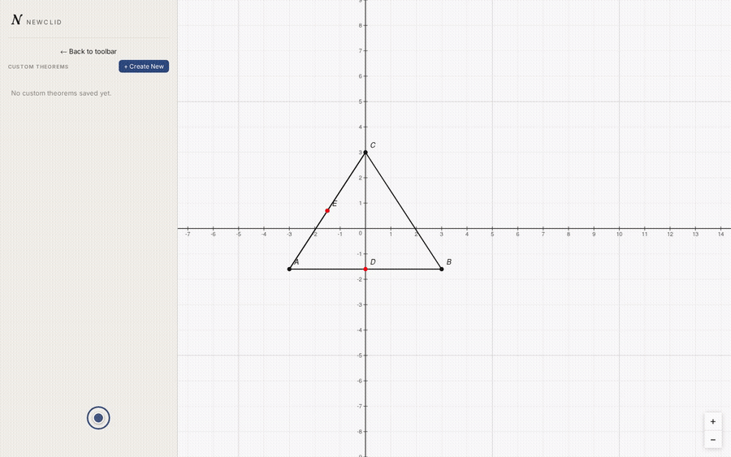
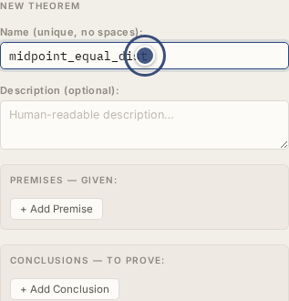
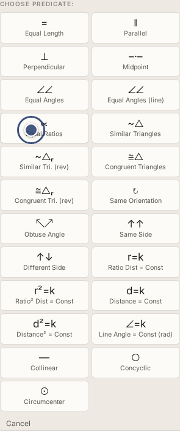
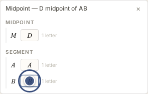
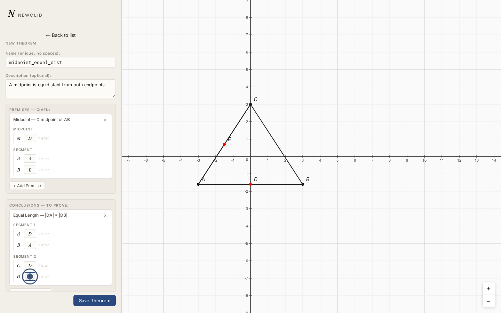
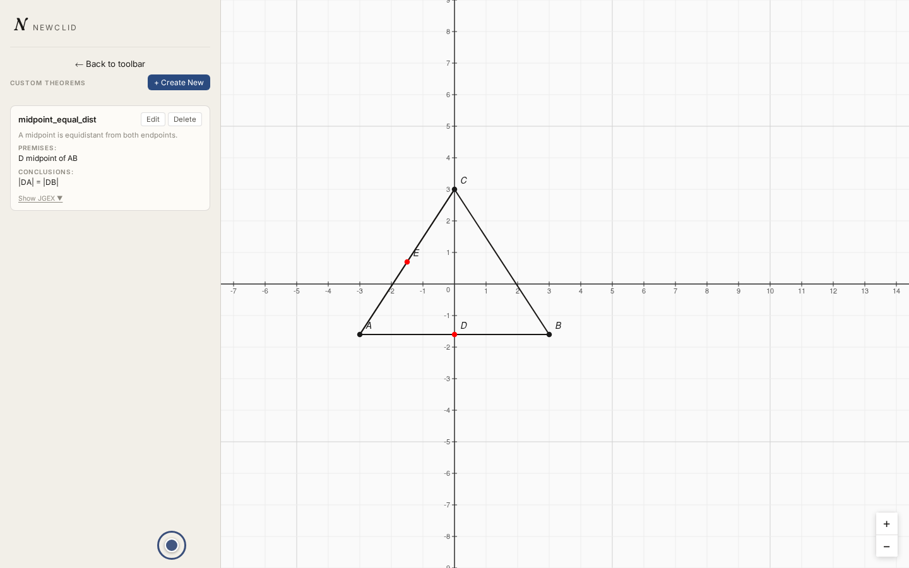

# Custom theorems

Custom theorems let you give the solver an extra lemma to use while proving
your goal — a premise/conclusion rule that isn't one of Newclid's built-in
theorems. This is useful when you know a shortcut applies to your specific
problem and want the solver to use it directly, instead of re-deriving it
from scratch every time.

As an example, let's teach the solver something true about our own
construction: since `D` is the midpoint of `AB`, the distances `DA` and `DB`
are equal. We'll name it `midpoint_equal_dist`. Picking up with `A`–`E`
already on the canvas from the earlier pages:

## Creating a theorem

1. Open **Advanced Options** in the toolbar and click
   **User-Defined Theorems**.
2. Click **+ Create New**.
3. Enter a **name** — `midpoint_equal_dist` — and an optional
   **description** — "A midpoint is equidistant from both endpoints."

    

4. Under **Premises**, click **+ Add Premise** and pick **Midpoint** from
   the grid.

    

    Fill in its point-label arguments as `D`, `A`, `B` (read as "D is the
    midpoint of AB").

    

5. Under **Conclusions**, click **+ Add Conclusion**, pick **Equal Length**,
   and fill in `D`, `A`, `D`, `B` (read as "DA equals DB").
6. Click **Save Theorem**.

The predicate grid covers the same range of relations available elsewhere
in the app (lengths, angles, ratios, triangle similarity and congruence,
collinearity, concyclicity, and a few constant-value forms like "distance
equals a constant").

## What happens after saving

The theorem is stored in your browser (it survives page reloads, but is
local to that browser — it isn't synced anywhere). It's automatically
included with every proof request you submit afterward; there's no need to
re-select it each time. Our midsegment goal doesn't actually *need*
`midpoint_equal_dist` to be proved — it's here to show the mechanism — but
the solver is free to use it if it helps.

## Editing or deleting a theorem

Open **User-Defined Theorems**, select the theorem, make your changes, and
save again — or select it and click **Delete** to remove it.

## Next step

With the goal and the theorem both in place, go back to **Define Goal**,
click **Submit**, and move on to
[reviewing the proof](reviewing-a-proof.md).
