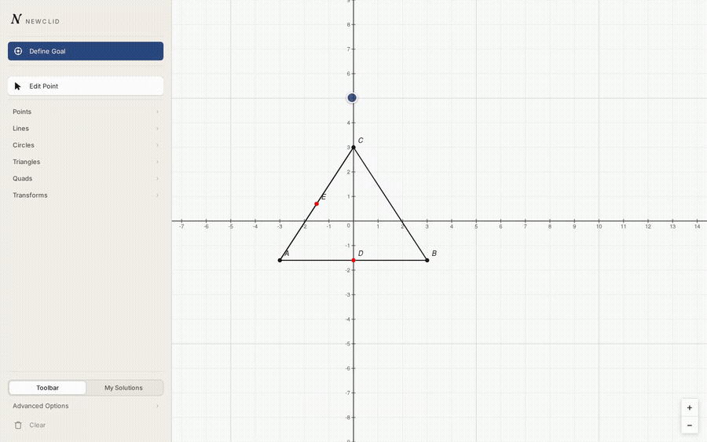
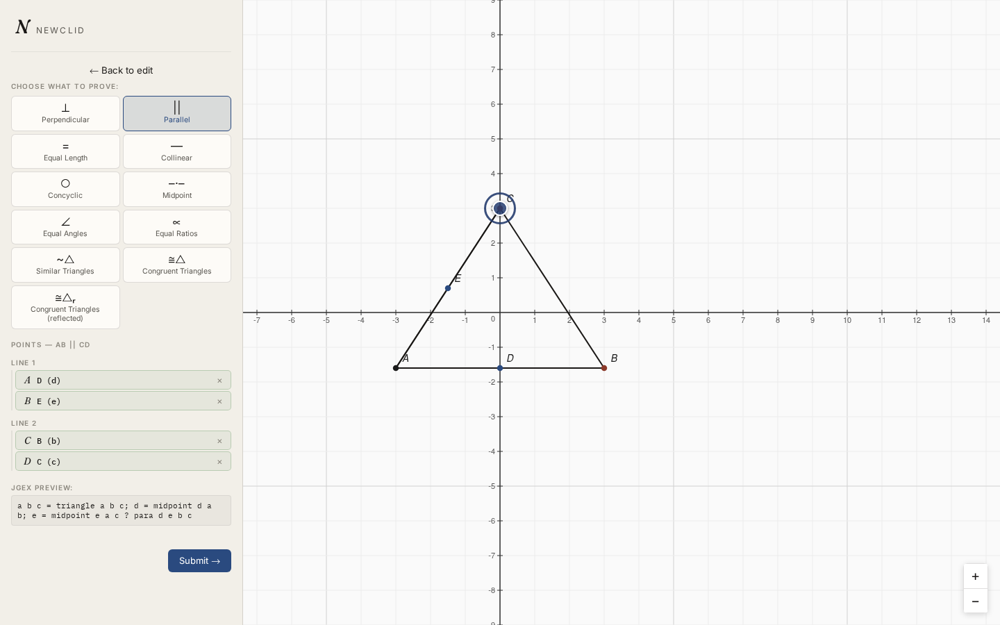
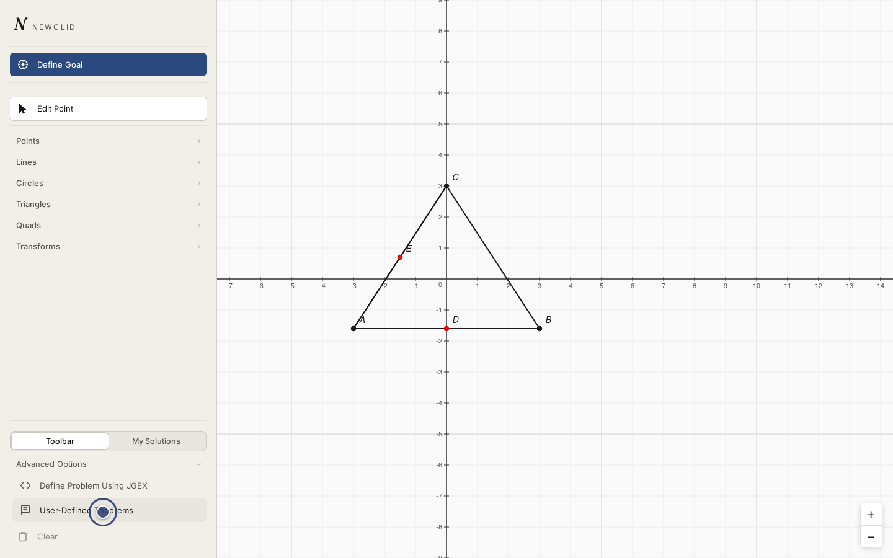
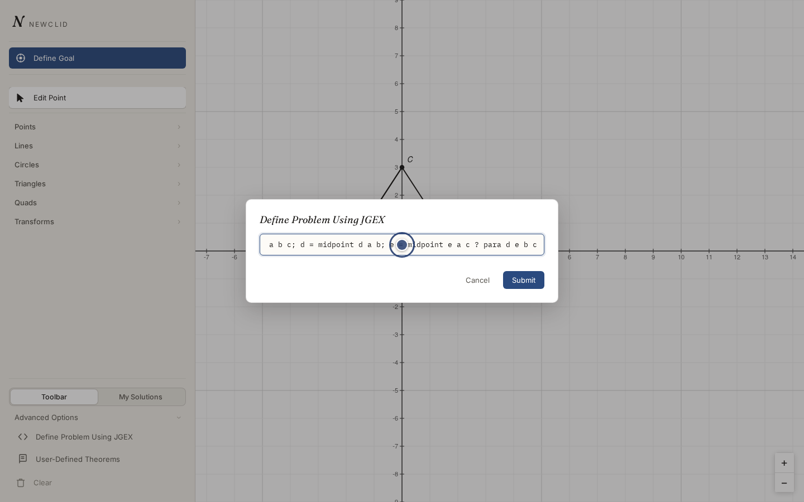

# Defining a goal

A goal is the statement you want the solver to prove. Ours: **`DE` is
parallel to `BC`** — the midsegment theorem, for the triangle and midpoints
from [constructing a problem](constructing-a-problem.md). There are two ways
to define it.

## Proof by points

Picking up right where [constructing a problem](constructing-a-problem.md)
left off — `A`, `B`, `C`, `D`, and `E` already on the canvas:



Click **Define Goal** in the toolbar. This opens a panel where you:

1. Pick what you want to prove from a grid of predicates — Perpendicular,
   **Parallel**, Equal Length, Collinear, Concyclic, Midpoint, Equal Angles,
   Equal Ratios, Similar Triangles, Congruent Triangles, and a few more.
   Pick **Parallel**.
2. Click canvas points, one per slot, to fill in the predicate's arguments.
   Each slot lights up on the canvas in its own color as you fill it in, so
   you can see which points belong to which part of the statement. For
   **Parallel**, that's two lines: click `D` then `E` for **Line 1**, then
   `B` then `C` for **Line 2**.
3. Check the JGEX preview shown above the submit button — this is exactly
   what will be sent to the solver. For our example it reads:
   ```text
   a b c = triangle a b c; d = midpoint d a b; e = midpoint e a c ? para d e b c
   ```
4. Click **Submit** — or, if you also want the solver to have the
   [custom theorem](custom-theorems.md) we're about to build, hold off and
   come back to this panel after that page.



Some predicates take a variable number of points — **Collinear**, for
example, starts at three points but has **"+ Add point"**/**"− Remove
last"** controls if you need more.

!!! tip "Congruent Triangles has two variants for a reason"
    **Congruent Triangles** and **Congruent Triangles (reflected)** aren't
    the same predicate picked twice — vertex order matters for both, and
    they differ in whether the two triangles have the same or opposite
    orientation (one being a mirror image of the other). The panel shows an
    explanation for both under the point slots; read it before picking
    points, since the wrong variant for your actual triangles will make the
    solver report the goal unproven even if it's geometrically true.

## Typing JGEX directly

If you already know JGEX syntax, open **Advanced Options** in the toolbar —
it also holds **User-Defined Theorems**, covered next — and click
**Define Problem Using JGEX**.



That opens a panel accepting a raw JGEX string; prefix any clause with `?`
to mark it as a goal. Typing our whole problem by hand looks like this:



```text
a b c = triangle a b c; d = midpoint d a b; e = midpoint e a c ? para d e b c
```

You can put more than one goal in the same problem, one per line — the
solver attempts to prove each one. This is also the only way to use a
predicate that the proof-by-points panel doesn't have a button for yet.

## Next step

Before submitting, let's give the solver a reusable fact about midpoints —
see [adding a custom theorem](custom-theorems.md). If you'd rather skip
straight to solving, submit now and go to
[reviewing the proof](reviewing-a-proof.md).
