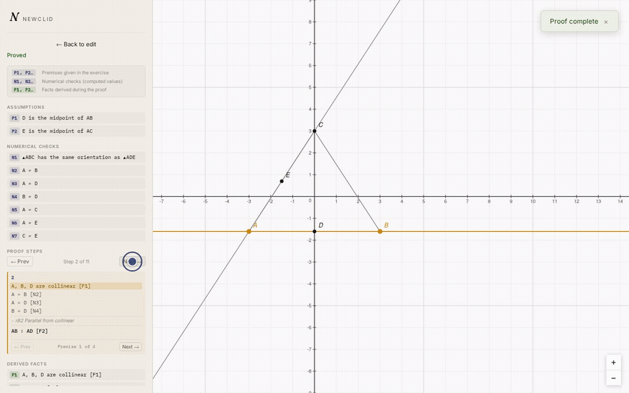
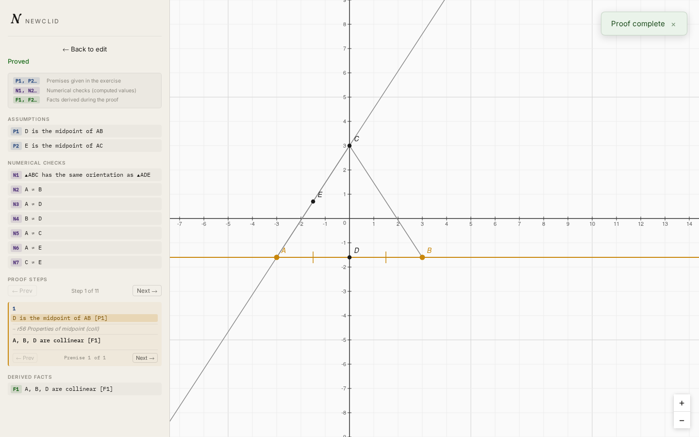
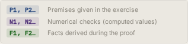
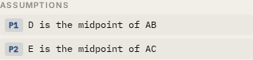
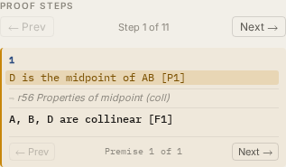
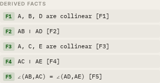
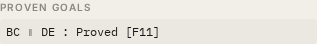
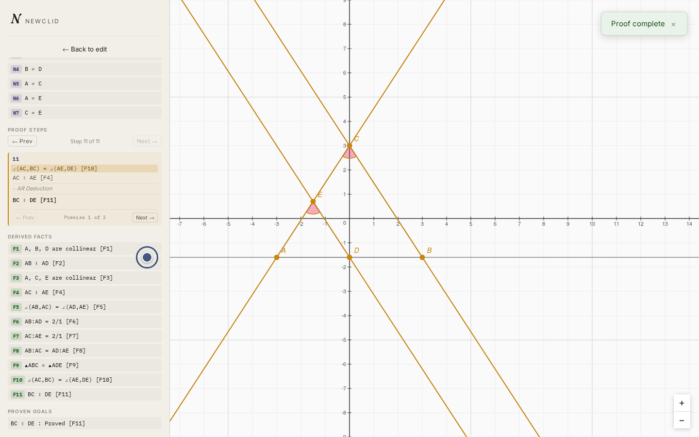

# Reviewing a proof

After you submit — our midsegment problem, goal `para d e b c`, with
`midpoint_equal_dist` available if the solver wants it — Viewclid switches
to the proof panel and shows a status badge: **Queued…**, **Running…**,
**Proved**, **Failed**, **Timed out**, or **Cancelled**. Queued and running
jobs poll automatically — you don't need to refresh anything.

Once it reads **Proved**, here's stepping through the result — from the
first derived fact to the final one:

## Reading a successful proof

Once the job is **Proved**, the panel shows, top to bottom:

- A **legend** explaining the highlight colors used on the canvas.

    

- **Assumptions** — the premises the proof starts from.

    

- **Numerical checks**, if any were needed — sanity checks the solver ran
  numerically rather than derived logically.
- A **step navigator** (**← Prev** / **Next →**) to move through the proof
  one derived fact at a time.

    

- **Derived Facts** for the current step — each step also has its own
  **← Prev** / **Next →** control for moving between the individual facts
  it derives.

    

- **Proven Goals**, once you reach the last step.

    

As you move through steps, the canvas highlights the geometry each step is
about: the premises it uses in one color, and what it concludes in another,
so you can follow the proof visually instead of just reading predicate
names. Step through to the end and you'll see `para d e b c` listed under
**Proven Goals** — the midsegment theorem, proved by Newclid.

## Reading a failed or partial result

If the solver couldn't prove everything, the panel still shows what it
*did* manage — a **Proved So Far** section, along with any unproven goals —
plus a message explaining the outcome. If the failure was a crash rather
than the solver simply running out of ideas, a raw error trace is shown at
the bottom of the panel; that's mainly useful if you're reporting a bug
rather than adjusting your problem.

If nothing seems to be happening for an unusually long time, see
[Debug frontend-backend flow](../frontend/guides/debug-frontend-backend-flow.md)
in the developer docs — it's written for diagnosing this, not just fixing
code.

## Redrawing

If your problem was submitted as JGEX (typed directly, or via proof by
points — as ours was) rather than drawn by hand, a **Redraw** button lets
you ask the solver to re-lay-out the same problem with different
coordinates — useful if the first layout the solver picked is visually
cramped or confusing. Redraw isn't available for problems you drew yourself
on the canvas, since your own drawing is already the intended layout.

## Starting a new problem

**"← Back to edit"** returns you to the canvas to change the construction or
try a different goal.
